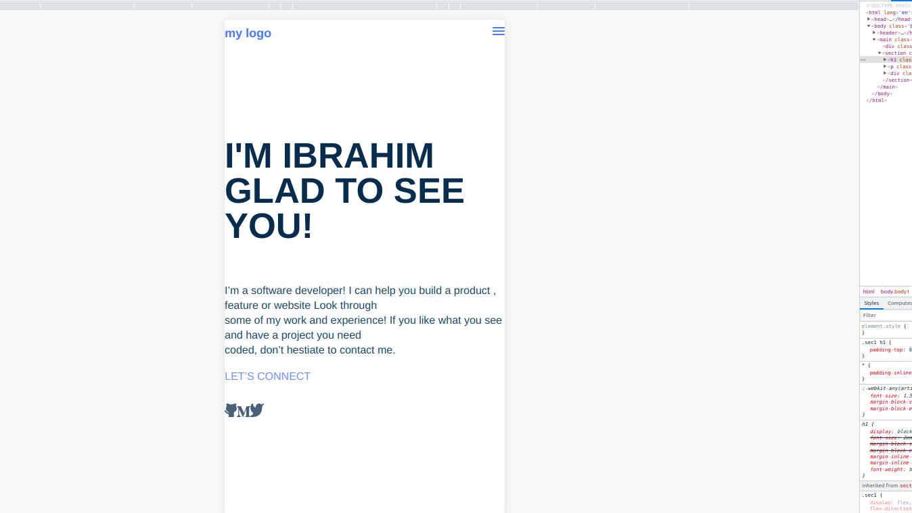
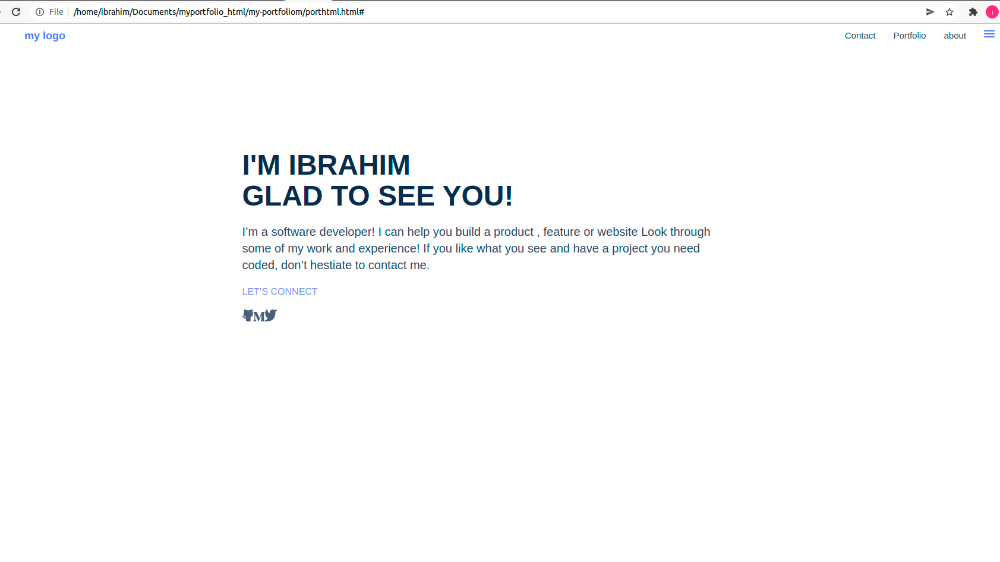

# my-portfoliom

# Project Name

Portfolio: setup and mobile version skeleton

> Description the project.

For the first milestone in the process of creating your portfolio website, you will:

set up a new repository and prepare it for development using best practices (e.g. linters).
build the first 2 sections of the mobile website using the template you chose in the previous step.

<<<<<<< HEAD

=======
>>>>>>> 4207069f26825060634c6a9169d4394f5735aec4
## Built With

- html
- css

### Prerequisites

### Setup

### Install

### Usage

### Run tests

### Deployment

## Authors

👤 **Author1**

- GitHub: [@githubhandle](https://github.com/ibrahim777764)

## Show your support

Give a ⭐️ if you like this project!

## Acknowledgments

- 
- Inspiration
- etc

## 📝 License

This project is [MIT](./MIT.md) licensed.
